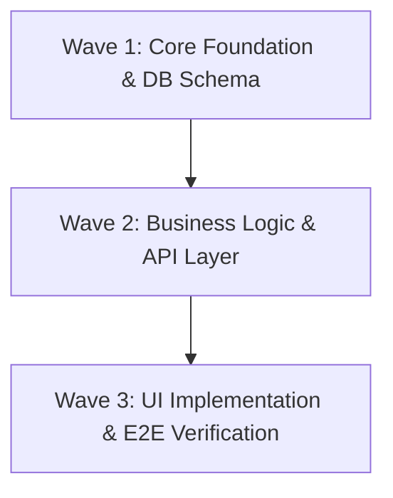

# Active System Development Backlog

> [!NOTE]
> Maintained under the 3-Level Progressive Disclosure Standard.
> Only active tasks (`READY` / `IN_PROGRESS`) are tracked here.
> Detailed task specifications live in [.agents/backlog/](file:///{{WORKSPACE_ROOT}}/.agents/backlog/).
> Completed items are archived to [Regression Registry Index](file:///{{WORKSPACE_ROOT}}/.agents/docs/registry/regression_registry.md).

---

## 🗺️ Active Execution Waves

---

## 📋 Active Task Allocation Matrix
 
| Task ID | Priority | Assigned Role | Exclusive Lock Path (Write Mutex) | Blocked By | Verification Command | Status |
| :--- | :--- | :--- | :--- | :--- | :--- | :--- |
| [TASK-INIT-01](file:///{{WORKSPACE_ROOT}}/.agents/backlog/TASK-INIT-01.md) | P0 | `orchestrator` | `.` | None | `pnpm test` | `READY` |

---

## 🧭 Strategic Reference Indexes
- Strategic Product Definition: [PRODUCT.md](file:///{{WORKSPACE_ROOT}}/PRODUCT.md)
- Visual Design System: [DESIGN.md](file:///{{WORKSPACE_ROOT}}/DESIGN.md)
- Subsystem Specifications: [.agents/docs/specs/](file:///{{WORKSPACE_ROOT}}/.agents/docs/specs/)
- Architecture Decision Records: [.agents/docs/adr/](file:///{{WORKSPACE_ROOT}}/.agents/docs/adr/)
- Regression Registry: [.agents/docs/registry/regression_registry.md](file:///{{WORKSPACE_ROOT}}/.agents/docs/registry/regression_registry.md)

---

## 🤖 Agent Execution Rules
1. **Lock Invariant**: Subagents MUST NOT edit files outside their assigned `Lock Path`.
2. **Step 1 Ingestion**: Subagents MUST read their standalone `TASK-XXX.md` file before editing code.
3. **Strict Pruning Mandate**: Completed items MUST be pruned immediately upon test verification.
