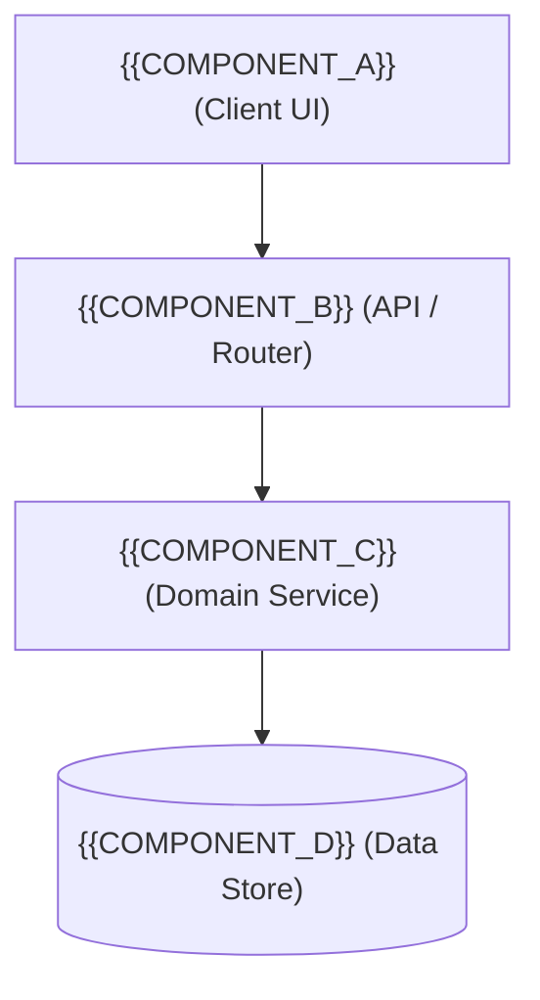

# Implementation Plan: {{FEATURE_NAME}}

> **YAGNI Defense Notice**: Scale this plan to task complexity. Aim when you need it:
> - **Small Tasks (<3 files)**: Retain Sections 1, 2, 4, 5. Omit diagrams, schemas, rollback. Keep <50 lines.
> - **Medium Tasks (3-8 files)**: Retain Sections 1, 2, 3 (interfaces only), 4, 5. Keep <90 lines.
> - **Large / High-Risk Tasks (>8 files / DB Migrations)**: Retain all sections. Keep ≤120 lines.
> 
> Operational tracking and subagent dispatches live in [task.md](file:///{{APP_DATA_DIR}}/brain/{{CONVERSATION_ID}}/task.md).

---

## 1. Executive Summary & Mental Model <!-- [REQUIRED: ALL TASKS] -->

- **Core Objective**: {{PLAIN_ENGLISH_OBJECTIVE}}
- **Mental Model**: {{ANALOGY_OR_HIGH_LEVEL_CONCEPT}}
- **Value Delivery**: {{MEASURABLE_OUTCOME}}
- **Explicit Non-Goals (YAGNI Guardrails)**:
{{EXPLICIT_NON_GOALS_LIST}}

---

## 2. Proposed Changes & Blast Radius <!-- [REQUIRED: ALL TASKS] -->

| Subsystem Domain | Path Pattern / Mutex Scope | Action | Risk Profile |
| :--- | :--- | :--- | :--- |
| **Domain Logic** | `src/domain/{{FEATURE_KEY}}/**` | NEW | Low |
| **API & Routing** | `src/server/routes/{{FEATURE_KEY}}.ts` | MODIFY | Medium |
| **Data Schema** | `src/db/schema/{{FEATURE_KEY}}.sql` | NEW | High |
| **Client UI** | `src/client/features/{{FEATURE_KEY}}/**` | NEW | Low |

---

## 3. Technical Strategy & Contracts <!-- [YAGNI: Omit for pure UI tweaks or simple fixes] -->

### 3.1 Interaction & Control Flow <!-- [YAGNI: Include if multi-component flow] -->


- **Control Flow**:
  1. `{{STEP_1}}`: Client validates input and dispatches command.
  2. `{{STEP_2}}`: API authenticates caller and delegates to service.
  3. `{{STEP_3}}`: Domain service executes logic and commits atomic state.

### 3.2 Data Models & Interfaces <!-- [YAGNI: Include if new types or schemas] -->
```typescript
export interface {{CORE_ENTITY}} {
  id: string;
  name: string;
  status: "ACTIVE" | "PENDING" | "ARCHIVED";
  createdAt: string;
  updatedAt: string;
}

export interface {{REQUEST_PAYLOAD}} {
  token: string;
  payload: Record<string, unknown>;
}

export interface {{RESPONSE_PAYLOAD}} {
  success: boolean;
  data: {{CORE_ENTITY}};
}
```

---

## 4. Acceptance Criteria (Given-When-Then) <!-- [REQUIRED: ALL TASKS] -->

- **Scenario 1 (Primary Happy Path)**:
  - **Given**: {{GWT_PRECONDITION}}
  - **When**: {{GWT_TRIGGER_ACTION}}
  - **Then**: {{GWT_EXPECTED_OUTCOME}}
- **Scenario 2 (Boundary / Error Handling)**:
  - **Given**: An invalid payload or unauthenticated caller session.
  - **When**: The request is dispatched to the endpoint handler.
  - **Then**: Request is rejected with typed error and status matching RFC 9110.

---

## 5. Unified Verification Commands <!-- [REQUIRED: ALL TASKS] -->

*Deterministic CLI commands exiting with code 0.*

```bash
# Inner-loop fast verification (<10s)
pnpm type-check
pnpm test -- tests/{{FEATURE_KEY}}

# Full project build and integration gate
pnpm lint
pnpm build
```

---

## 6. Rollback & Contingency <!-- [YAGNI: Required for High-Risk & DB migrations; omit for small tasks] -->

- **Baseline Snapshot**: `git rev-parse HEAD > .rollback_checkpoint`
- **Surgical Rollback**:
  ```bash
  git checkout $(cat .rollback_checkpoint) -- <SUBSYSTEM_PATH>
  git clean -fd <SUBSYSTEM_PATH>
  ```
- **Database Downward Migration**: `{{DOWN_MIGRATION_COMMAND}}`
- **Circuit Breaker**: If Layer 1 CLI checks fail after 3 self-repair loops ($K=3$), halt edits and trigger `EXCEPTION_SPAR`.
