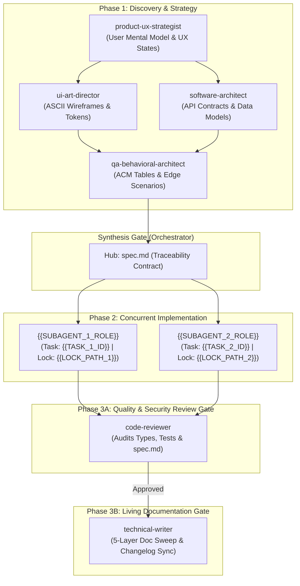

# Master Implementation Plan: {{FEATURE_NAME}}
- **Orchestrator**: Lead Orchestrator (`orchestrator`)
- **Specification Reference**: [.agents/specs/{{FEATURE_KEY}}/spec.md](file:///{{WORKSPACE_ROOT}}/.agents/specs/{{FEATURE_KEY}}/spec.md)
- **Feature Branch**: `feature/{{BRANCH_NAME}}`
- **Living Document URI**: `{{PLAN_ABSOLUTE_URI}}`

---

## 1. Executive Summary & Plain-English Mental Model
{{PLAIN_ENGLISH_MENTAL_MODEL}}

---

## 2. Multi-Agent DAG Execution Topology



---

## 3. Subagent Task Allocation Matrix
Every subagent MUST inspect this matrix at Step 1 to understand its bounded scope, lock paths, and dependencies:

| Subagent ID | Assigned Role | Task ID | Exclusive Subsystem Lock Paths (Write Mutex) | Upstream Inputs | Downstream Dependents | Acceptance Criteria |
| :--- | :--- | :--- | :--- | :--- | :--- | :--- |
| **Agent-1** | `{{SUBAGENT_1_ROLE}}` | `{{TASK_1_ID}}` | `{{LOCK_PATH_1}}` | `spec.md` | `Agent-3` (Review) | `AC-101`, `AC-102` |
| **Agent-2** | `{{SUBAGENT_2_ROLE}}` | `{{TASK_2_ID}}` | `{{LOCK_PATH_2}}` | `spec.md` | `Agent-3` (Review) | `AC-201`, `AC-202` |
| **Agent-3** | `code-reviewer` | `TASK-REV` | Read-Only (Workspace Diffs) | Agent-1, Agent-2 Memos | `Agent-4` (Docs) | 0 Lint, 0 Type, 100% ACM Pass |
| **Agent-4** | `technical-writer` | `TASK-DOC` | Project Docs & Indices | Agent-3 Approval | Sprint Baseline | 5-Layer Sweep Complete |

---

## 4. Single-Writer Serialization Gates
Shared root files MUST NEVER be edited concurrently in Phase 2 tasks. They are serialized strictly to a single writer:

- **Root Routing**: `{{ROUTES_FILE}}` *(Assigned strictly to {{ROLE_X}} after Task {{TASK_Y}} completes)*
- **Data Schemas**: `{{SCHEMA_FILE}}` *(Assigned strictly to {{ROLE_Z}} prior to client implementation)*
- **Rollback Safety**: If any implementer trips the 2-retry circuit breaker, obtain user approval, then execute path-scoped rollback: `git restore <LOCK_PATH> ; git clean -fd <LOCK_PATH>`. Never run global `git restore .`.

---

## 5. Unified Verification Commands
```powershell
# Fast Implementer Checks (1-3s inner loop)
pnpm type-check
pnpm test

# Quality Gatekeeper Checks (code-reviewer)
pnpm lint
pnpm build
```

---

## 6. Mandatory Subagent Directives
1. **Step 1 Ingestion**: Execute `view_file` on `spec.md` at Step 1.
2. **Game Plan Huddle**: Submit your game plan via `send_message` showing target files ([NEW], [MODIFY], [DELETE]) and how your interfaces fulfill the Traceability Matrix. Wait for explicit `"APPROVED"`.
3. **2-Retry Circuit Breaker**: Implementers have a maximum of 2 self-repair attempts before escalating to the orchestrator.
