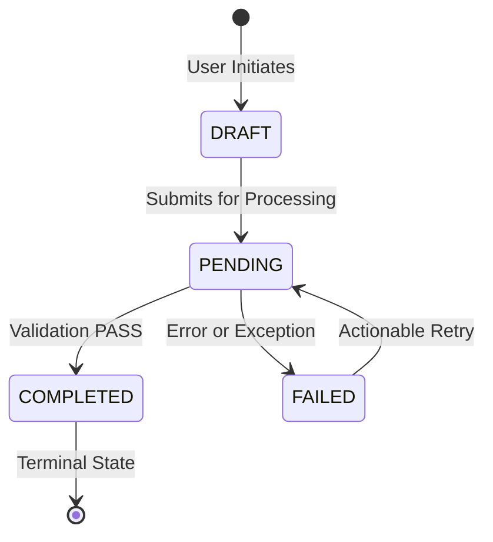

# Subsystem Reference: {{SUBSYSTEM_TITLE}}

> [!NOTE]
> This document conforms to the **Diátaxis Documentation Framework (Reference & Explanation)**. It serves as an evergreen, AST-synchronized architectural specification for the `{{SUBSYSTEM_KEY}}` subsystem.

---

## 1. Subsystem Architecture & Boundary Context
- **Purpose**: Owns and encapsulates all business logic, database transactions, and route handlers for `{{SUBSYSTEM_KEY}}`.
- **Primary Domain Services**: `src/modules/{{SUBSYSTEM_KEY}}/service.ts`
- **Controller Route Handlers**: `src/modules/{{SUBSYSTEM_KEY}}/controller.ts`

---

## 2. Canonical Data Models & Interface Contracts (1:1 AST Parity)

```typescript
export interface {{SUBSYSTEM_KEY}}Entity {
  readonly id: string;
  readonly status: "{{STATUS_A}}" | "{{STATUS_B}}";
  readonly createdAt: Date;
  readonly updatedAt: Date;
}
```

---

## 3. Lifecycle State Machine Transitions


---

## 4. Error Envelopes & Failure Recovery Policies
| Error Code | HTTP Status | Retryable | Exact Recovery Protocol |
| :--- | :--- | :--- | :--- |
| `ERR_{{KEY}}_NOT_FOUND` | 404 Not Found | False | Check entity ID existence in caller payload |
| `ERR_{{KEY}}_CONFLICT` | 409 Conflict | True | Generate new `Idempotency-Key` and retry |
| `ERR_{{KEY}}_RATE_LIMITED` | 429 Too Many Requests| True | Back off exponentially per `Retry-After` header |

---

## 5. Verification Harness & Integration Invariants
```powershell
pnpm vitest run src/modules/{{SUBSYSTEM_KEY}}
```
- **Invariant 1**: All database mutations MUST execute within an explicit transaction boundary.
- **Invariant 2**: Zero foreign keys may exist without matching database indexes.
